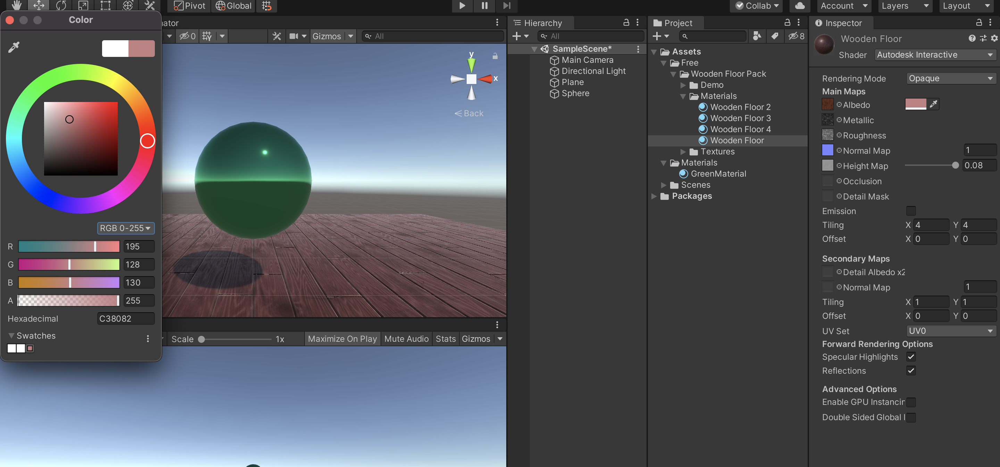
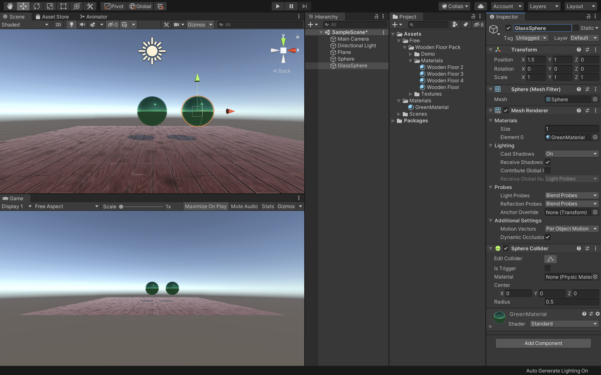

# ウォークスルーアプリの作成

## 新規プロジェクトの作成

<br>

今回はVRアプリケーションの基礎となる3D室内のアセットのインポートと、操作するプレイヤーを作成します。

まずは新規プロジェクトを作成しましょう。


UnityHubを開き、右上の新規作成ボタンを押してください。

テンプレートは3Dのままで、プロジェクト名はなんでも構いません。ここでは「WalkThrough」としておきます。
保存先を決めたら作成ボタンを押してください。

<br>


Unityが開けたらUnityエディタのレイアウトを任意の形にしてください。
Unityエディタの右上の「Layout」から好きなレイアウトを設定できます。
こちらの教材では「2 × 3」を利用します。

そしてSceneの名前を「WalkScene」に変更してください。  
上記の画像のようなウィンドウが表示されたら「Reload」を選択してください。

<br>

## アセットストアからインポート

### 建物のインポート

<br>

プロジェクト作成が終わったら早速アセットストアから3D素材をインポートします。


UnityのWindowタブからAssetStoreを選択します。
そうすると、このようにSceneウィンドウの場所にAssetStoreが表示されますので、検索から「FurnishedCabin」を検索してインポートしてください。

<br>


このアセットに格納されているPrefabsを利用すれば簡単に部屋を作成できるのですが、今回はこのアセットに入っているScenesからDemoのSceneをダブルクリックで開きましょう。

そして、初めからヒエラルキーウィンドウにある「FPSController」と「Prototype」を削除してください。  
これで準備は完了です。

<br>


## プレイヤーの作成


次に実際に室内を歩き回るプレイヤーを作成します。
ヒエラルキーウィンドウからCapsuleを作成し、任意の場所に配置します。Caplsuleの下が地面にギリギリ設置するように配置してください。  
少し大きいのでサイズを調整しましょう。  
TransformのScaleを  
X : 0.5  
Y : 0.8  
Z : 0.5  
に変更してください。

これでプレイヤーの準備は完了です。

<br>

## 動作スクリプトの作成

次に動作用のスクリプトを作成します。  
今回の動作は「カプセルの移動」「カメラのアングル変更」になります。

<br>


まずはプロジェクトウィンドウから新規フォルダを作成し、名前を「Scripts」に変更してください。
そしてその中に「PlayerContoroller」という名前の新規スクリプトを作成し、格納します。  
そして、PlayerControllerスクリプトをヒエラルキーのCapsuleにアタッチしてください。  
この一連の作業が分からない場合は前回までの教材等で調べながら挑戦してみましょう。  

アタッチまでできたらPlayerControllerスクリプトをVisualStudioで開きましょう。

<br>

VisualStudioでスクリプトを開いたら、コードを下記のように変更してください。

```c#
using System.Collections;
using System.Collections.Generic;
using UnityEngine;

public class PlayerController : MonoBehaviour
{
    public float speed = 0.02f;

    void Start()
    {
        
    }

    // Update is called once per frame
    void Update()
    {
        float x = Input.GetAxis("Horizontal");
        float z = Input.GetAxis("Vertical");

        transform.Translate(x * speed, 0.0f, z * speed);
    }
}
```

<br>

クラスの先頭にスピード用のパブリック変数を定義し、初期値に0.02fを代入しました。

Updateメソッドの中にキーボードの十字キーの値を取得し、それぞれ変数x、zに代入し、Capsuleのx座標とz座標に代入しています。  
ここまで記述終わったら、コードを保存し、Unityに戻りましょう。

<br>


現在はカメラを配置していないので、ヒエラルキーウィンドウからCameraを追加し、Capsuleが見えるように配置してください。

この状態で一度実行してみましょう。

<br>


そうすると、このように部屋の中を自由に動き回れるようになりました。  
しかし部屋のオブジェクトを全て通り抜けてしまいます。これはCapsuleに衝突判定用のRigidbodyがアタッチされていない為です。

一度実行を終了し、CapsuleのインスペクターのAddComponentからRigidbodyを追加してもう一度実行してください。

<br>


これで家具を通り抜けないようになりましたが、今度は衝突すると倒れてしまうようになりました。

こちらを修正します。

<br>


ヒエラルキーウィンドウでCapsuleが選択されているのを確認し、インスペクターウィンドウで、RigidbodyのConstraintsの「▶︎」をクリックし展開します。  
そして「FreezeRotation」の項目のX、Y、Zにチェックを入れてください。

これで実行してみると、家具に当たっても転倒しなくなりました。

<br>

## 視点を動かすスクリプトの作成

次のステップとしてCapsuleにカメラを取り付け、一緒に動くようにし、さらにマウスで上下左右を見渡せるようにしたいと思います。

### Capsuleにカメラをつける



まずはヒエラルキーウィンドウでCameraをCapsuleの子要素にしてください。  
そして、CameraのTransformを  
Position X : 0  
Position Y : 0.8  
Position Z : -0.2

Scale X : 1  
Scale Y : 1  
Scale Z : 1

に変更してください。  
これで人の目線と同じような高さでカメラを移動させるようにできました。

<div class="point">
    CameraのZ座標に「-0.2」を代入すると、壁についた時に壁の外側が見えてしまうバグを予防することができます。（カメラをCapsuleの内側に移動させたため）
</div>

<br>

### 視点変更のスクリプト追加

現状だと視点が固定されているのでマウスで自由に変更できるようにします。



プロジェクトウィンドウで新規スクリプトを作成し、名前を「CameraController」としてください。  
そしてそのスクリプトをScripsフォルダに格納し、ヒエラルキーウィンドウのCapsuleにアタッチしてください。  
次にこのCameraScriptをVisualStudioで開きます。

<br>

CameraControllerスクリプトを開いたらコードを以下のように変更してください。

```c#
using System.Collections;
using System.Collections.Generic;
using UnityEngine;

public class CameraController : MonoBehaviour
{
    public GameObject cameraView;

    void Start()
    {
        
    }

    void Update()
    {
        float mouseX = Input.GetAxis("Mouse X");
        float mouseY = Input.GetAxis("Mouse Y");

        transform.Rotate(0.0f, mouseX, 0.0f);
        cameraView.transform.Rotate(-mouseY, 0.0f, 0.0f);
    }
}
```

ここまで記述終わりましたら、コードを保存してUnityに戻りましょう。

<br>


CapsuleのインスペクターのCameraControllerにCameraViewという項目が追加されていると思うので、そこにヒエラルキーからCameraをドラッグ&ドロップしてください。  
ここまでできたら一度Unityを実行してみましょう。

マウスの移動に合わせて視点が上下左右に移動できていれば成功です。


忘れずにUnityを保存しておきましょう。