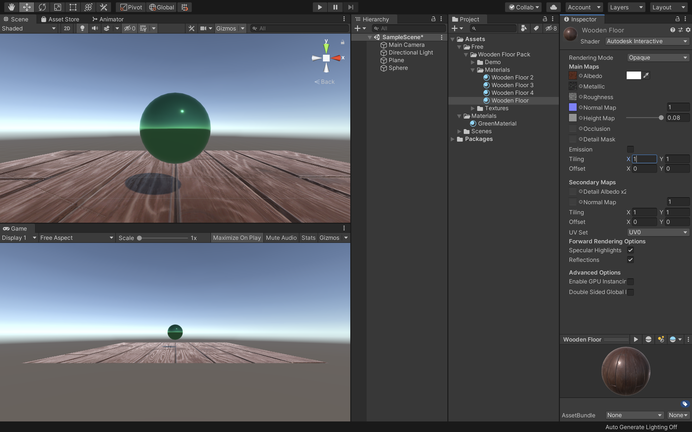

# マテリアルの作成

## 新規プロジェクトの作成

<br>

今回は3Dモデルの見た目や質感といった品質を高めるためのマテリアルの設定方法と、基本的な４つのマテリアルの作成方法を解説します。

まずは新規プロジェクトを作成しましょう。


UnityHubを開き、右上の新規作成ボタンを押してください。

テンプレートは3Dのままで、プロジェクト名はなんでも構いません。ここでは「MaterialSample」としておきます。
保存先を決めたら作成ボタンを押してください。

<br>


Unityが開けたらUnityエディタのレイアウトを任意の形にしてください。
Unityエディタの右上の「Layout」から好きなレイアウトを設定できます。
こちらの教材では「2 × 3」を利用します。

そして新規で「Plane」を作成してください位置はX、Y、Z共に0にしておきましょう。

<br>

## シーンビューをゲームビューに合わせる

マテリアルの設定を見えやすくするためにシーンビューをゲームビューと同じカメラアングルに切り替えます。
<br>


ヒエラルキーウィンドウでMainCameraを選択してください。
そして、GameObjectメニューから「Align View to Selected」をクリックしてください。

<br>


そうすると、このようにゲームビューとシーンビューが同じ見た目になりました。  
これで準備は完了です。  

シーンビューが全体的に暗いといった場合は、Windowタブから「Rendering -> LightingSettings -> AutoGenerate」にチェックを入れてください。  
PCへの負荷がかかりますが、きちんと光が表現できるようになります。

<br>


## スフィアの作成


次にマテリアルを変更するサンプルとしてSphereを配置してください。  
SphereのTransformを  
X : 0  
Y : 1  
Z : 0 
に変更してください。
そしてSphereをシーンビューで拡大しておきます。

<br>

## 単色マテリアル

まずは基本の単色マテリアルを設定してみます。  
単色マテリアルでも金属の質感やコンクリートのような質感を表現することができます。

<br>


まずはプロジェクトウィンドウから新規フォルダを作成し、名前を「Materials」に変更してください。
そしてその中に「GreenMaterial」という名前の新規マテリアルを作成し、格納します。  
そして、先ほど作成したSphereにアタッチしてください。  
この一連の作業が分からない場合は前回までの教材等で調べながら挑戦してみましょう。  

マテリアルをアタッチできたら上記の画像のようにSphereが緑色になっているかと思います。

<br>


ここまでできたら、GreenMaterialを選択し、インスペクターウィンドウから「Metallic」と「Smoothness」の値を変更してみましょう。  
MetallicとSmoothnessの値を1に近づけるとより金属のようになり、0に近づけると光沢のないマットな質感に変わるかと思います。

<br>

## テクスチャ画像マテリアル

<br>

次に画像を使ったマテリアルをアタッチします。  
画像を使うと、木目やレンガ、壁紙といった見た目のマテリアルを簡単に作成することができます。

<br>


通常のテクスチャ（画像）をインポートして使用しても構わないのですが、普通の画像のみだと例えば木目の凹凸や傷などが表現しきれず、のっぺりとした質感になってしまいます。  
Unityではそのような画像に凹凸や傷などの立体感を出すためにノーマルマップ（法線マッピング）を貼り付けるのですが、こちらはPhotoshopやBlenderといった専用のアプリケーション等で制作する必要があるので、今回はAssetStoreからダウンロードして作成していきたいと思います。

どのテクスチャを使用しても構わないのですが、今回は「WoodenFloorMaterials」を利用します。  
AssetStoreからこちらを検索し、インポートしてください。少し時間がかかるかもしれません。

<br>



インポートが完了したら、プロジェクトウィンドウから「Assets -> Free -> WoodenFloorPack -> Materials -> FoodenFloor」をヒエラルキーのPlaneにドラッグ&ドロップでアタッチしてください。  
こちらは既にノーマルマップが設定されていますので、きちんと凹凸が表現され、ただの画像を利用するよりも質感が高くなっています。


<br>


このままでも十分なのですが、今回のPlaneの広さに対してテクスチャが少し大きく配置されてしまっているので調整します。  
プロジェクトウィンドウからWoodenFloorを選択し、インスペクターの「Tiling」のX、Yをそれぞれ4に変更してください。

これでより細かい木目のタイルになりました。

Tilingはテクスチャ全体を何枚表示にするのかを設定します。  
X、Yとも4にすると、「4×4」の計16枚の画像を並べているように見えます。
長い廊下等を作成する場合は1枚のPlaneを拡大させてテクスチャを貼ると、伸びたようになってしまうのでTilingを使ってちょうどいい配置にする必要があります。

<br>


また、プロジェクトウィンドウで「WoodenFloor」を選択し、インスペクターウィンドウのアルベドのカラーを変更すると、上の画像のように色を乗算することもできます。

<br>

## 視点を動かすスクリプトの作成

次のステップとしてCapsuleにカメラを取り付け、一緒に動くようにし、さらにマウスで上下左右を見渡せるようにしたいと思います。

### Capsuleにカメラをつける


まずはヒエラルキーウィンドウでCameraをCapsuleの子要素にしてください。  
そして、CameraのTransformを  
Position X : 0  
Position Y : 0.8  
Position Z : -0.2

Scale X : 1  
Scale Y : 1  
Scale Z : 1

に変更してください。  
これで人の目線と同じような高さでカメラを移動させるようにできました。

<div class="point">
    CameraのZ座標に「-0.2」を代入すると、壁についた時に壁の外側が見えてしまうバグを予防することができます。（カメラをCapsuleの内側に移動させたため）
</div>

<br>

### 視点変更のスクリプト追加

現状だと視点が固定されているのでマウスで自由に変更できるようにします。


プロジェクトウィンドウで新規スクリプトを作成し、名前を「CameraController」としてください。  
そしてそのスクリプトをScripsフォルダに格納し、ヒエラルキーウィンドウのCapsuleにアタッチしてください。  
次にこのCameraScriptをVisualStudioで開きます。

<br>

CameraControllerスクリプトを開いたらコードを以下のように変更してください。

```c#
using System.Collections;
using System.Collections.Generic;
using UnityEngine;

public class CameraController : MonoBehaviour
{
    public GameObject cameraView;

    void Start()
    {
        
    }

    void Update()
    {
        float mouseX = Input.GetAxis("Mouse X");
        float mouseY = Input.GetAxis("Mouse Y");

        transform.Rotate(0.0f, mouseX, 0.0f);
        cameraView.transform.Rotate(-mouseY, 0.0f, 0.0f);
    }
}
```

ここまで記述終わりましたら、コードを保存してUnityに戻りましょう。

<br>


CapsuleのインスペクターのCameraControllerにCameraViewという項目が追加されていると思うので、そこにヒエラルキーからCameraをドラッグ&ドロップしてください。  
ここまでできたら一度Unityを実行してみましょう。

マウスの移動に合わせて視点が上下左右に移動できていれば成功です。


忘れずにUnityを保存しておきましょう。