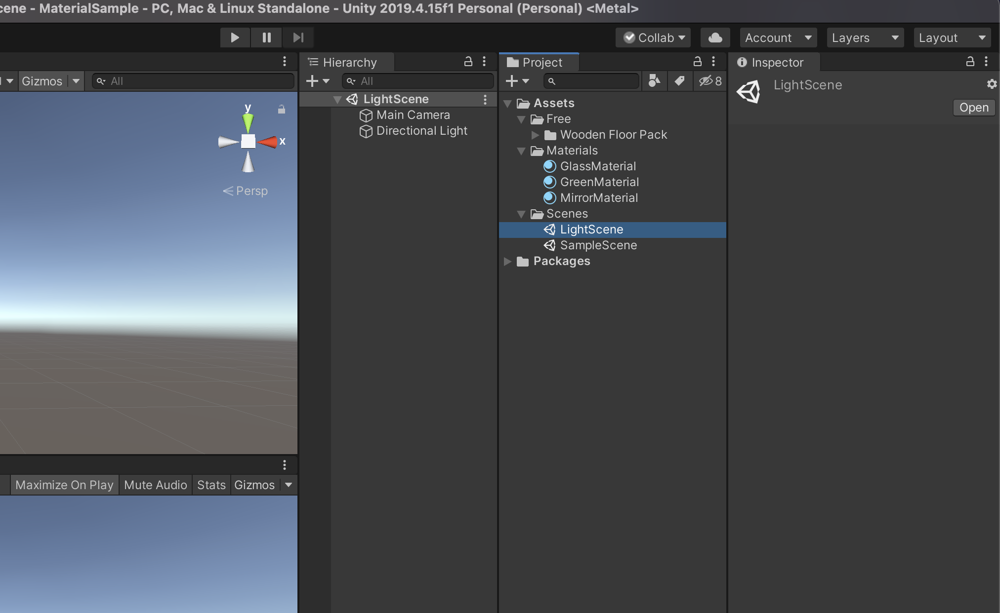
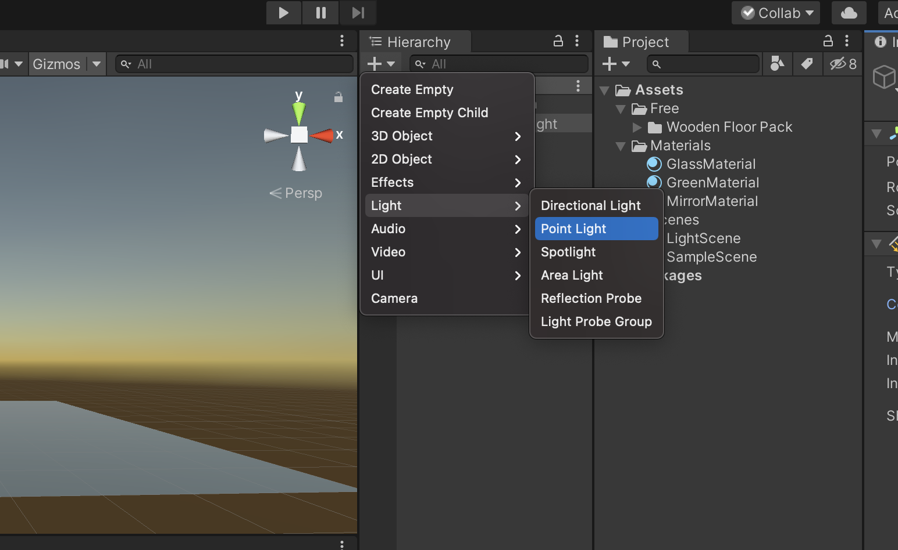
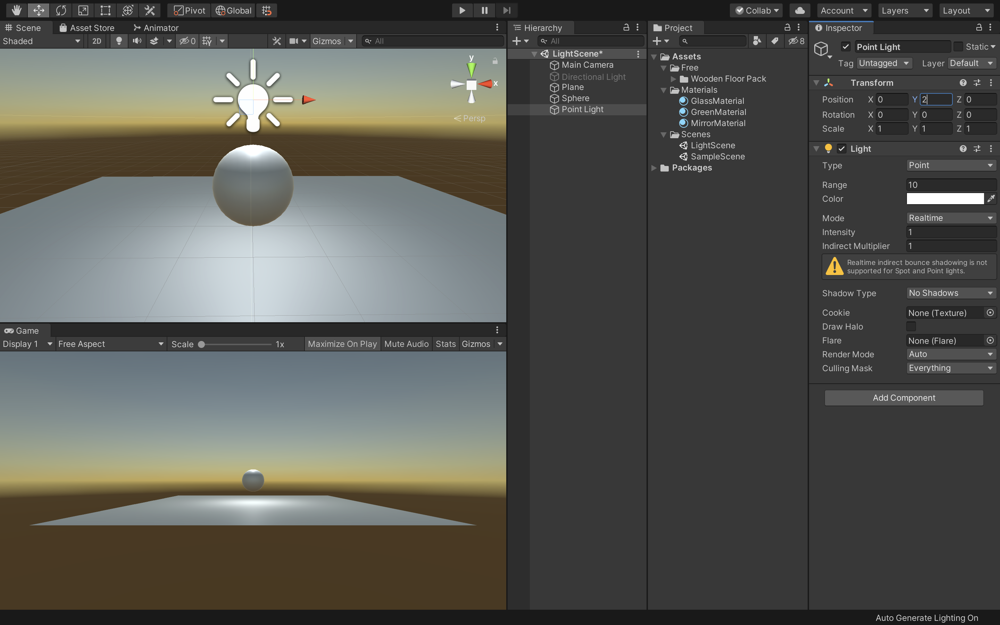
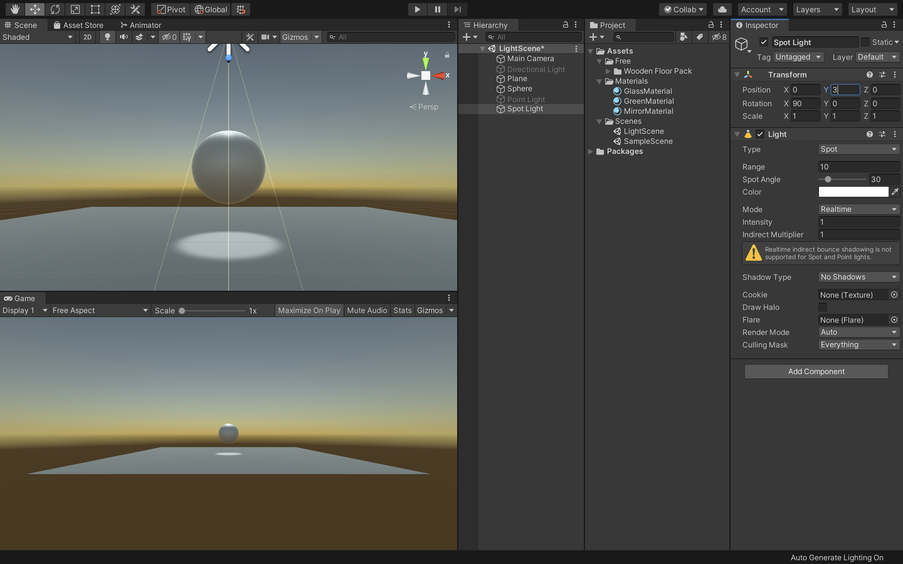
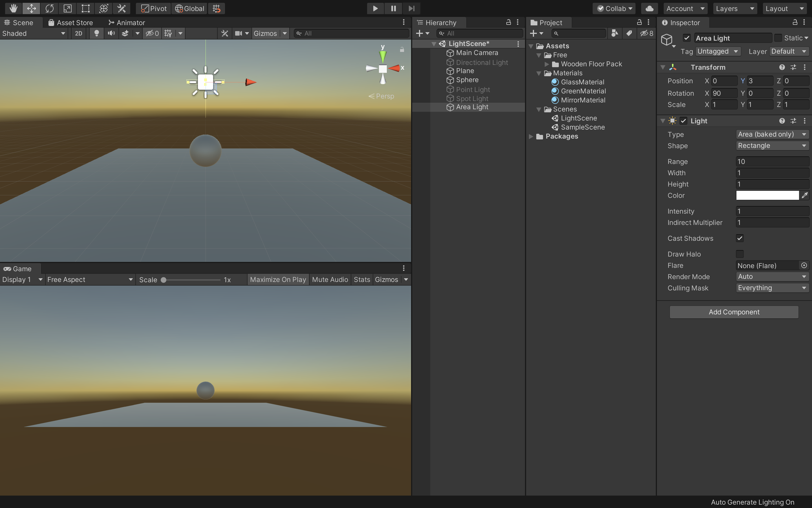
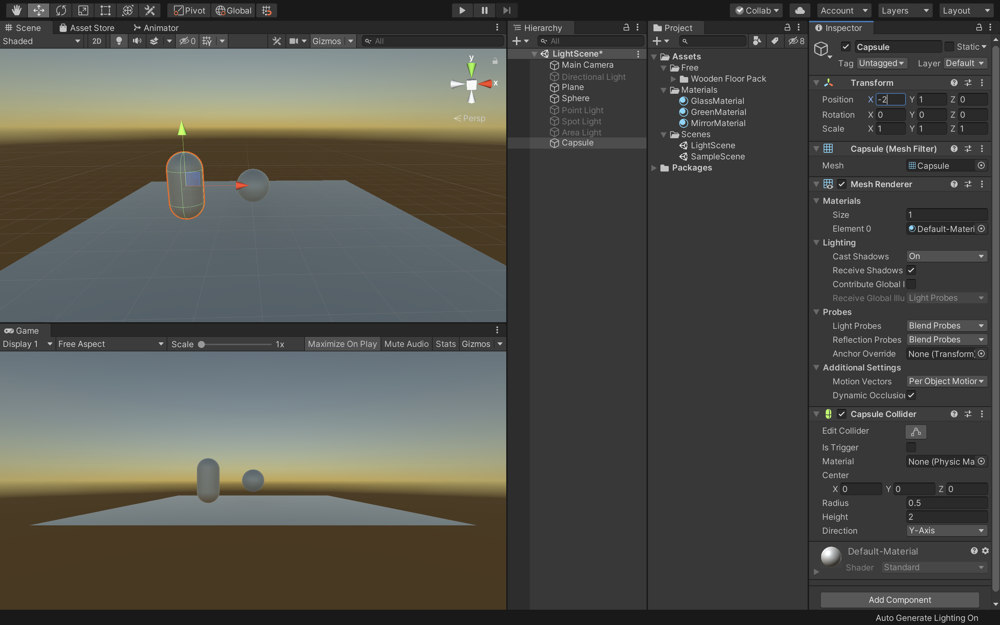
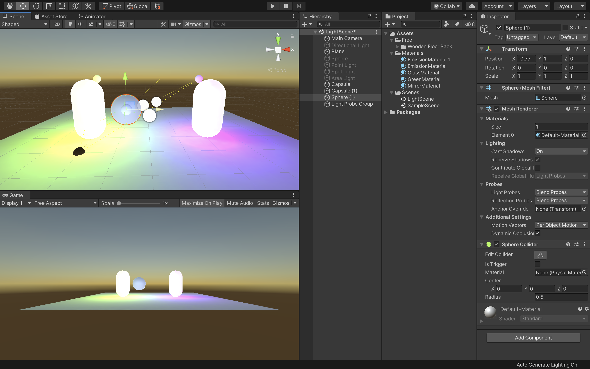
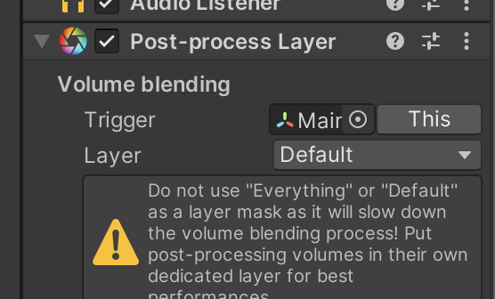

# ライトの作成と配置

Unityが3Dオブジェクトのシェーディングを計算するためには、そのオブジェクトに当たる光の強度、方向、色の情報が必要です。

これらのプロパティは、シーン内にあるLightオブジェクトによって提供されます。ライトのタイプが異なると、異なる方法で設定された色を発します。  
ライトの中には、光源から距離で減衰するものもあります。

Unityでは色々な使用目的で、複雑で高度なライティング効果を様々な異なる方法で計算することが可能です。

Unityのライティング方法は大まかにいうと、「リアルタイム」のものと、「事前計算」によるものがあり、両方組み合わせて使うことでシーンのライティングをより印象的にできます。

## リアルタイムライティング

デフォルトでは、Unityにはディレクショナルライト、スポットライト、ポイントライトがあります。それらのライトはシーンのダイレクトライトとともに、毎フレーム更新されます。ライトとゲームオブジェクトがシーン内で移動すると、ライトは即座に更新されます。これはシーンとゲームビューどちらでも確認できます。

リアルタイムライティングはシーン内のオブジェクトをライティングする最も基本的な方法で、キャラクターなどの動くジオメトリを照らすのに向いています。  
残念ながらUnityのリアルタイムライトから放たれる光は、一度放たれた後は反射しません。より写実的でリアルなシーンを作成するためには、事前計算によるライティングを有効にして、グローバルイルミネーションなどの技法を使います。

## ライトマップのベイク

Unityでは、静的で複雑なライティング効果を計算することができます。計算結果はライトマップと呼ばれる参照用テクスチャマップに保存されます。この計算プロセスをベイクといいます。

ライトマップをベイクすると、シーン内にある静的なオブジェクトへの光源の影響が計算され、この結果がシーン内のジオメトリの上に、テクスチャとしてオーバーライドされます。これによってライティング効果が生み出されます。

これらのライトマップにはサーフェスを直に照らす直接光と、シーン内にある他のオブジェクトやサーフェスから跳ね返ってくる間接光のどちらも含めることができます。  
ライティングをベイクして生成されたライトマップには、ゲーム中に変更を加えることができません。そのため静的（スタティック）と呼ばれます。リアルタイムライトは、ライトマップされたシーンの上から加算的にオーバーライドして使うことはできますが、ライトマップ自体を変化させることはありません。  

この手法により、ゲーム中にライトを自在に動かす自由と引き換えに、モバイル端末のような非力なハードウェア上でのパフォーマンス向上を狙うことができます。

 

## ライトの種類

### ポイントライト

ポイントライトは、空間のある一点に位置し、全方向に同等に光を放ちます。面に当たる光の方向は、その接地点とライトオブジェクトの中心点を結んだ直線です。光の強度は距離と共に減衰し、指定した距離で0になります。光の強度は、光源からの距離の2乗に反比例します。これは「逆2乗の法則」として知られ、実世界での光の性質に似ています。

ポイントライトは、シーン内のランプや他の局所的な光源をシミュレーションするのに役立ちます。

 

### スポットライト

ポイントライト同様、スポットライトもその位置と光の当たる範囲がしてされています。ただし、スポットライトは限られた角度内の光になるため、照明領域が円錐状になります。円錐の中心は、ライトオブジェクトの前方方向を指しています。また、ライトはスポットライトの円錐の端で減衰します。

一般的にスポットライトは、懐中電灯、車のヘッドライト、サーチライトなどといった人工的な光源として使用されます。スクリプトやアニメーションで方向を制御すれば、動きのあるスポットライトでシーン内のごく狭いエリアを照らし、印象的なライティング効果を作り出すことができます。

 

### ディレクショナルライト

ディレクショナルライトは、シーンで太陽光などの効果を作り出すのに役立ちます。太陽のように様々な様子に変化するディレクショナルライトは、限りなく遠くに存在する光源から発する光と考えることができます。ディレクショナルライトは明確な光源の位置を持たないので、ライトオブジェクトはシーン内のどこにでも置くことができます。  
シーン内の全てのオブジェクトが、あたかも光が常に同じ方向から差しているかのように照らされます。ターゲットオブジェクトからライトまでの距離が設定されていないので、光が減衰することもありません。

ディレクショナルライトは太陽や月のシミュレーションに使うこともできます。

 

### エリアライト

エリアライトは空間内の長方形によって決定されます。光は表面エリア全方向に均一に放射されますが、長方形の片側のみからになります。エリアライトの範囲に関しては、手動の制御はできません。ただし、光源から遠くなるにつれ、光の強度は距離の逆2乗で減衰します。ライティングの計算がプロセッサーにかなりの負担をかけるため、エリアライトはランタイムでは使用できず、ライトマップにベイクされる方法によってのみ使用することができます。

エリアライトは複数の異なる方向から同時にオブジェクトを照らすので、他の種類のライトと比べてシェーディングが柔らかく繊細になります。写実的な街灯や、プレイヤーに近いところに複数並んだライトの表現などに使用できます。小さなエリアライトは小さな光源（家のインテリアのライトなど）をシミュレートでき、ポイントライトよりも写実的な光顔を得られます。

 

### 発光マテリアル

エリアライトのように、発光マテリアルは、その表面が発行します。発光マテリアルはシーンの反射光を作るのに効果的で、色や強度などの関連するプロパティをゲームの間に変化させることができます。

「Emission」はスタンダードシェーダーのプロパティで、シーンの静的オブジェクトを発光させることができます。デフォルトではEmissionの値は0に設定されています  
発光マテリアルに範囲の値はありませんが、放射されるライトは、ここでも２次レートで減衰します。放射された光を受けることができるのはインスペクターウィンドウでStaticかLightmap Staticに設定されたオブジェクトだけです。

発光マテリアルはネオンなどの目に見える光源を表現するのに役立ちます。

また、発光マテリアルは静的オブジェクトに直接効果を与える場合のみ有効で、静的でないオブジェクトに発光マテリアルからライトを当てる必要がある場合は、ライトローブを使用する必要があります。

## 新規シーンの作成

新規プロジェクトを作成しても構わないのですが、今回は前回作成したプロジェクトに新規シーンを作成してそちらでライトのテストをしていきたいと思います。  
プロジェクトウィンドウで「Scenes」フォルダを選択し、新規で「Scene」を作成してください。  
新規シーンの作成方法は右クリックでCreateからでも作成できますし、上の「＋」ボタンからでも作成することができます。  
Scenesフォルダを選択しておくと自動的にそのフォルダ内に新規シーンを作成することができます。

作成できたら名前を「LightScene」としてダブルクリックで開きましょう。

 

まずは地面とスフィアを新規で追加します。  
Planeの座標は画面の中央（X:0、Y:0、Z:0）にし、スフィアの座標はX:0、Y:1、Z:0に設定してください。

また、画面が暗くなっている場合は「Window -> Rendering -> LightingSettings」からAutoGenerateにチェックを入れておきましょう。

 

## ポイントライト

まずはポイントライトを使用してみたいと思います。

ヒエラルキーウィンドウからDirectionalLightを選択し、インスペクターウィンドウで名前の横のチェックを外し非アクティブにしておきましょう。

 

次に、ヒエラルキーウィンドウから「Light -> PointLight」を選択してください。そうすると、シーンビューに新規でポイントライトが配置されました。

 

次にポイントライトの座標を「X:0、Y:2、Z:0」に変更してください。これでスフィアの上にポイントライトを配置できたかと思います。  
また、光源が少し小さいのでIntensityの値を2に変更してください。

デフォルトでは影の表示が非表示になっているのでインスペクターウィンドウのShadowTypeを「SoftShadows」に変更してください。
これで地面にスフィアの影が投影されているかと思います。  
そしてLightのRangeで効果範囲を指定することができます。

このようにポイントライトは暗い場所をふわっと明るくしたり、焚き火の炎の明るさを表現する時などに有効です。  
Position（位置）、Range（到達範囲）、Intensity（光の強さ）の設定が重要になってきます。

 

## スポットライト

次にスポットライトを作成したいと思います。  
まずは現在設定されているポイントライトを非アクティブにしてヒエラルキーウィンドウから「Light -> SpotLight」を選択し、新規でスポットライトを作成してください。

次にスポットライトのY座標を3にしてください。

これでスポットライトがスフィアの上に配置され下のスフィアを照らすようになりました。

 

スポットライトは名前のまま、円錐型に放射される光源です。  
Rangeで光が届く範囲の距離を、SpotAngleで光が届く範囲の広さを指定します。そしてこのライトも減衰します。色々パラメーターをいじって調整してみてください。

 

## エリアライト

次にエリアライトを設定します。  
エリアライトは面光源で、基本的に長方形の形をしており、片面から光を投射するライトです。静的に設定されたオブジェクトのみに作用します。

蛍光灯の照明や、窓の外に配置して窓から差し込む光を表現する時などに利用されます。

例えば大きな部屋の中で絶対に動かない家具や小物などをStaticにしてスポットライトを利用すれば、あまりデータを重くせずに繊細な光や影を表現することができます。

 

まずは現在表示されているスポットライトを非アクティブにしましょう。

そしてヒエラルキーウィンドウからAreaLightを選択してください。
次にY座標を3に変更してください。  
これでスフィアの上にエリアライトを配置することができました。しかし、エリアライトはStaticなオブジェクトにのみ適用されるので何も変化がありません。  

 

エリアライトを適用させるためにヒエラルキーウィンドウでSphereとPlaneを選択し、インスペクターウィンドウでStaticにチェックを入れてください。  
しばらく待っていると、Bakeが実行されてきちんと光が投影されました。少し光源が弱いのでIntensityの値を4に変更してください。

 

エリアライトはPosition、RotationやIntensityの値で様々な表現をすることができます。また、WidthとHeightで照らす平面の大きさを変更できます（Scaleは反映されませんので注意してください）。

さらにLightの項目にある「Shape」を「Rectangle」から「Disc」に変えると四角の光源が円盤形に変化します。

 

## 発光するオブジェクト

次に発光するオブジェクトを作成したいと思います。

発光のオブジェクトはEmission（放出）を使用します。  
Emissionはサーフェスから放出するライトの色と強さを制御します。Emissionを有効にすると、内側から照らされているような表現になります。例えば暗闇の中のモニターの画面だったりコントロールパネルの光ボタンなどに利用されます。

まずは現在シーン内で有効になっているエリアライトを非アクティブにします。  
そして光オブジェクトとして新規でCapsuleを作成してください。

 

次にプロジェクトウィンドウのMaterialsフォルダの中に新規でMaterialを作成し、名前を「EmissionMaterial」としてください。  
新規マテリアルを作成できたらCapsuleにドラッグ&ドロップしてアタッチします。

 

次にEmissionMaterialを選択した状態でインスペクタウィンドウのEmissionの項目にチェックを入れてください。

そうすると、下にColorの項目が出てくるのでそこにある「HDR」と書かれている四角い部分をクリックします。  
そうすると、HDRColorパレットが表示されるので、そこで任意のカラーを選択し、Intensityを２にしてください。

 

最後にCapsuleのStaticにチェックを入れてください。これで無事に発光して周りに光の影響が反映されているかと思います。

 

次にCapsuleを複製し、X座標を２にしてください。  
そしてEmissionMaterialを複製し、カラーを変更して今複製したCapsuleにアタッチします。そうすると、左右に発光するオブジェクトが配置され、中央のスフィアが両方からの反射の影響を受けているのがわかるかと思います。これはこのスフィアがStaticになっているためです。

ではStaticではないオブジェクト、例えばプレイヤーなどにこの発光の光を反射させるにはどうすればいいのでしょうか。

一番簡単な方法はライトプローブを適用させることです。

 

一旦今表示されているスフィアを非アクティブにし、新規でスフィアを作成してください。  
場所はX:0、Y:1、Z:0とします。

そうすると、こちらのスフィアはStaticなオブジェクトではないので発光の影響を受けません。

 

こちらのスフィアに発光の影響を与えるために、ヒエラルキーウィンドウから「Light -> LightProbeGroup」を選択してください。座標はスフィアと同じ場所にしておきます。

これでStaticではないスフィアにも反射光が反映されました。

片方のオブジェクトに近づくと、その色が強く反映されるのが確認できるかと思います。

 

もしわかりにくい場合は色を対照的なものに変更して確認してください。

 

## おまけ

最後に少し追加でUnityのエフェクトの追加方法について解説します。

現在の発光オブジェクトは、このようにはっきりとした輪郭で表示されています。  
しかし、現実では発光体や強い光を反射している物体は少しぼやけて見えるかと思います。

Unityではそのようなエフェクトを追加する機能、「PostProcessing」が備わっています。

実際に試してみましょう。

 

まずはUnityの「Window -> PackageManager」を開いてください。  
その中から「PostProcessing」を選択し、Installを実行します。  

 

次にMainCameraにAddComponentで「Post-process Layer」をアタッチします。  

 

Post-Process Layerを追加すると、PostProcess対象レイヤーがNothingとなっているので、これをDefaultに変更します。  

 

次に空のゲームオブジェクトを作成し、インスペクターウィンドウから「Post-process Volume」をアタッチしてください。  

 

そして「isGrobal」にチェックを入れ、Newボタンを押してください。  

 

最後に「AddEffect」ボタンをクリックして追加したいエフェクトを選択します。例えばBloomを選択して値を設定すると、光が屈折して輪郭ばぼやけるように見えます。  

他にも様々なエフェクト効果がありますので、ぜひ色々調べながら追加してみてください。