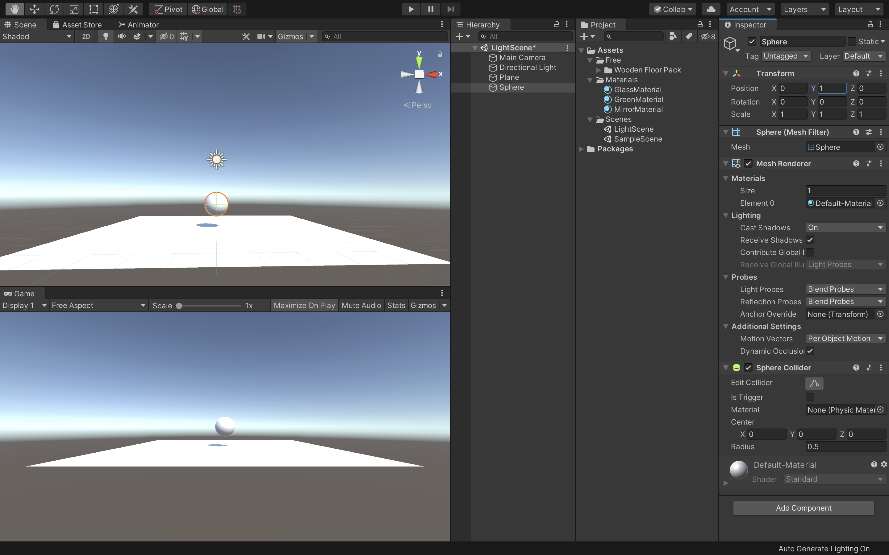
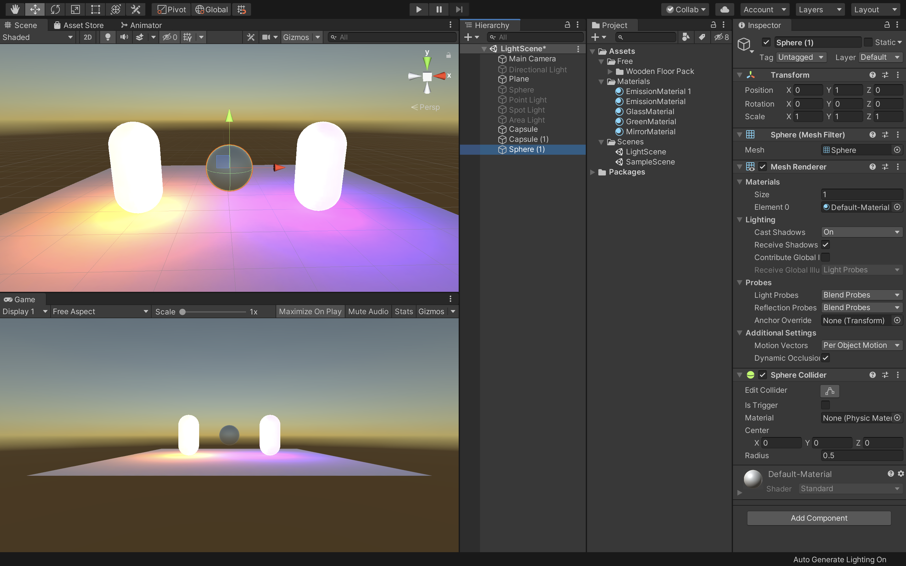
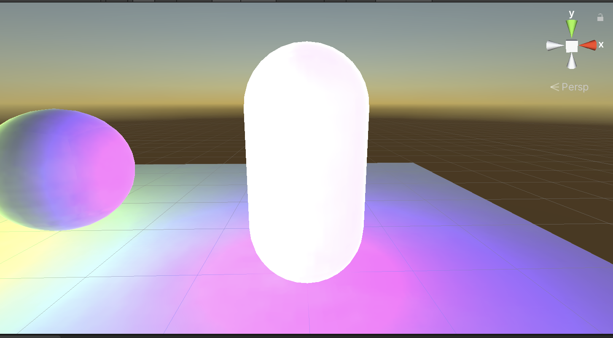

# ライトの作成と配置

Unityが3Dオブジェクトのシェーディングを計算するためには、そのオブジェクトに当たる光の強度、方向、色の情報が必要です。

これらのプロパティは、シーン内にあるLightオブジェクトによって提供されます。ライトのタイプが異なると、異なる方法で設定された色を発します。  
ライトの中には、光源から距離で減衰するものもあります。

Unityでは色々な使用目的で、複雑で高度なライティング効果を様々な異なる方法で計算することが可能です。

Unityのライティング方法は大まかにいうと、「リアルタイム」のものと、「事前計算」によるものがあり、両方組み合わせて使うことでシーンのライティングをより印象的にできます。

## リアルタイムライティング

デフォルトでは、Unityにはディレクショナルライト、スポットライト、ポイントライトがあります。それらのライトはシーンのダイレクトライトとともに、毎フレーム更新されます。ライトとゲームオブジェクトがシーン内で移動すると、ライトは即座に更新されます。これはシーンとゲームビューどちらでも確認できます。

リアルタイムライティングはシーン内のオブジェクトをライティングする最も基本的な方法で、キャラクターなどの動くジオメトリを照らすのに向いています。  
残念ながらUnityのリアルタイムライトから放たれる光は、一度放たれた後は反射しません。より写実的でリアルなシーンを作成するためには、事前計算によるライティングを有効にして、グローバルイルミネーションなどの技法を使います。

## ライトマップのベイク

Unityでは、静的で複雑なライティング効果を計算することができます。計算結果はライトマップと呼ばれる参照用テクスチャマップに保存されます。この計算プロセスをベイクといいます。

ライトマップをベイクすると、シーン内にある静的なオブジェクトへの光源の影響が計算され、この結果がシーン内のジオメトリの上に、テクスチャとしてオーバーライドされます。これによってライティング効果が生み出されます。

これらのライトマップにはサーフェスを直に照らす直接光と、シーン内にある他のオブジェクトやサーフェスから跳ね返ってくる間接光のどちらも含めることができます。  
ライティングをベイクして生成されたライトマップには、ゲーム中に変更を加えることができません。そのため静的（スタティック）と呼ばれます。リアルタイムライトは、ライトマップされたシーンの上から加算的にオーバーライドして使うことはできますが、ライトマップ自体を変化させることはありません。  

この手法により、ゲーム中にライトを自在に動かす自由と引き換えに、モバイル端末のような非力なハードウェア上でのパフォーマンス向上を狙うことができます。

<br>

## ライトの種類

### ポイントライト

ポイントライトは、空間のある一点に位置し、全方向に同等に光を放ちます。面に当たる光の方向は、その接地点とライトオブジェクトの中心点を結んだ直線です。光の強度は距離と共に減衰し、指定した距離で0になります。光の強度は、光源からの距離の2乗に反比例します。これは「逆2乗の法則」として知られ、実世界での光の性質に似ています。

ポイントライトは、シーン内のランプや他の局所的な光源をシミュレーションするのに役立ちます。

<br>

### スポットライト

ポイントライト同様、スポットライトもその位置と光の当たる範囲がしてされています。ただし、スポットライトは限られた角度内の光になるため、照明領域が円錐状になります。円錐の中心は、ライトオブジェクトの前方方向を指しています。また、ライトはスポットライトの円錐の端で減衰します。

一般的にスポットライトは、懐中電灯、車のヘッドライト、サーチライトなどといった人工的な光源として使用されます。スクリプトやアニメーションで方向を制御すれば、動きのあるスポットライトでシーン内のごく狭いエリアを照らし、印象的なライティング効果を作り出すことができます。

<br>

### ディレクショナルライト

ディレクショナルライトは、シーンで太陽光などの効果を作り出すのに役立ちます。太陽のように様々な様子に変化するディレクショナルライトは、限りなく遠くに存在する光源から発する光と考えることができます。ディレクショナルライトは明確な光源の位置を持たないので、ライトオブジェクトはシーン内のどこにでも置くことができます。  
シーン内の全てのオブジェクトが、あたかも光が常に同じ方向から差しているかのように照らされます。ターゲットオブジェクトからライトまでの距離が設定されていないので、光が減衰することもありません。

ディレクショナルライトは太陽や月のシミュレーションに使うこともできます。

<br>

### エリアライト

エリアライトは空間内の長方形によって決定されます。光は表面エリア全方向に均一に放射されますが、長方形の片側のみからになります。エリアライトの範囲に関しては、手動の制御はできません。ただし、光源から遠くなるにつれ、光の強度は距離の逆2乗で減衰します。ライティングの計算がプロセッサーにかなりの負担をかけるため、エリアライトはランタイムでは使用できず、ライトマップにベイクされる方法によってのみ使用することができます。

エリアライトは複数の異なる方向から同時にオブジェクトを照らすので、他の種類のライトと比べてシェーディングが柔らかく繊細になります。写実的な街灯や、プレイヤーに近いところに複数並んだライトの表現などに使用できます。小さなエリアライトは小さな光源（家のインテリアのライトなど）をシミュレートでき、ポイントライトよりも写実的な光顔を得られます。

<br>

### 発光マテリアル

エリアライトのように、発光マテリアルは、その表面が発行します。発光マテリアルはシーンの反射光を作るのに効果的で、色や強度などの関連するプロパティをゲームの間に変化させることができます。

「Emission」はスタンダードシェーダーのプロパティで、シーンの静的オブジェクトを発光させることができます。デフォルトではEmissionの値は0に設定されています  
発光マテリアルに範囲の値はありませんが、放射されるライトは、ここでも２次レートで減衰します。放射された光を受けることができるのはインスペクターウィンドウでStaticかLightmap Staticに設定されたオブジェクトだけです。

発光マテリアルはネオンなどの目に見える光源を表現するのに役立ちます。

また、発光マテリアルは静的オブジェクトに直接効果を与える場合のみ有効で、静的でないオブジェクトに発光マテリアルからライトを当てる必要がある場合は、ライトローブを使用する必要があります。


## 新規シーンの作成


新規プロジェクトを作成しても構わないのですが、今回は前回作成したプロジェクトに新規シーンを作成してそちらでライトのテストをしていきたいと思います。  
プロジェクトウィンドウで「Scenes」フォルダを選択し、新規で「Scene」を作成してください。  
新規シーンの作成方法は右クリックでCreateからでも作成できますし、上の「＋」ボタンからでも作成することができます。  
Scenesフォルダを選択しておくと自動的にそのフォルダ内に新規シーンを作成することができます。

作成できたら名前を「LightScene」としてダブルクリックで開きましょう。

<br>



まずは地面とスフィアを新規で追加します。  
Planeの座標は画面の中央（X:0、Y:0、Z:0）にし、スフィアの座標はX:0、Y:1、Z:0に設定してください。

また、画面が暗くなっている場合は「Window -> Rendering -> LightingSettings」からAutoGenerateにチェックを入れておきましょう。

<br>

## ポイントライト


まずはポイントライトを使用してみたいと思います。

ヒエラルキーウィンドウからDirectionalLightを選択し、インスペクターウィンドウで名前の横のチェックを外し非アクティブにしておきましょう。

<br>


次に、ヒエラルキーウィンドウから「Light -> PointLight」を選択してください。そうすると、シーンビューに新規でポイントライトが配置されました。

<br>


次にポイントライトの座標を「X:0、Y:2、Z:0」に変更してください。これでスフィアの上にポイントライトを配置できたかと思います。  
また、光源が少し小さいのでIntensityの値を2に変更してください。

デフォルトでは影の表示が非表示になっているのでインスペクターウィンドウのShadowTypeを「SoftShadows」に変更してください。
これで地面にスフィアの影が投影されているかと思います。  
そしてLightのRangeで効果範囲を指定することができます。

このようにポイントライトは暗い場所をふわっと明るくしたり、焚き火の炎の明るさを表現する時などに有効です。  
Position（位置）、Range（到達範囲）、Intensity（光の強さ）の設定が重要になってきます。

<br>

## スポットライト


次にスポットライトを作成したいと思います。  
まずは現在設定されているポイントライトを非アクティブにしてヒエラルキーウィンドウから「Light -> SpotLight」を選択し、新規でスポットライトを作成してください。

次にスポットライトのY座標を3にしてください。

これでスポットライトがスフィアの上に配置され下のスフィアを照らすようになりました。


<br>


スポットライトは名前のまま、円錐型に放射される光源です。  
Rangeで光が届く範囲の距離を、SpotAngleで光が届く範囲の広さを指定します。そしてこのライトも減衰します。色々パラメーターをいじって調整してみてください。

<br>


次に、シーンをBuildするシーンとして登録します。

Unityから「File -> BuildSettings」を開きましょう。

そして、右上の方にある「AddOpenScenes」をクリックして下さい。  
これで現在のシーンを登録できました。  
次にゲームシーンである「SampleScene」も登録します。プロジェクトウィンドウからSampleSceneをドラッグ&ドロップで「ScenensInBuild」の場所に追加して下さい。  
これで登録は完了です。

<div class="warning">
    シーンは上から順番に再生されるので上にTitleSceneを配置して下さい。<br>
    順番はドラッグ&ドロップでも変更できます。
</div>

<br>

こちらのウィンドウを消してUnityを保存し、実行してみましょう。

Startボタンを押してきちんと画面遷移（Unityちゃんがいるシーンに移動）できていれば成功です。


## ゲームのビルド

次に現在のUnityのプロジェクトをビルドしたいと思います。  
今回はPCゲームとしてビルドしてみましょう。  
ただし、このままでもビルドできるのですが１つ問題点があります。

それは現状のままアプリをビルドすると、アプリが全画面で表示され、終了させる事ができないという点です。

WebGLへのビルドはブラウザの閉じるボタンをクリックすれば終了できるのですが、PCゲームだと終了ボタンを作らないと強制終了しか終わらせる方法がありません。

ですので、今回は「ESC」ボタンを押したらアプリを終了できるように修正します。

<br>


まずはプロジェクトウィンドウで新規に「GameQuit」スクリプトを作成し、Scriptsフォルダに格納して下さい。

<br>

そしてGameQuitスクリプトをVisualStudioで開き、コードを以下のように変更して下さい。

```c#
using System.Collections;
using System.Collections.Generic;
using UnityEngine;

public class GameQuit : MonoBehaviour
{
    void Update()
    {
        if (Input.GetKey(KeyCode.Escape))
        {
            Application.Quit();
        }
    }
}
```


`if (Input.GetKey(KeyCode.Escape))`でパソコンのESCキーが押されたらという条件分岐になります。

`Application.Quit();`でアプリケーションを終了させるという命令文になっていますので、ESCキーが押された瞬間にこちらのアプリケーションが終了されます。

ここまでを保存してUnityに戻りましょう。

<br>


ヒエラルキーでGameManagerを選択し、インスペクターにGameQuitスクリプトをドラッグ&ドロップでアタッチして下さい。  
そしてこちらのシーンを保存します。

<br>


同様にSampleSceneを開き、新しく空のGameManagerオブジェクトを作成し、GameQuitスクリプトをアタッチして保存して下さい。

これで準備か完了です。

<br>


UnityのFileからBuildSettingsを開きましょう。  
そしてビルドするシーンが登録されているか、ビルドするアプリケーションのプラットフォームは合っているか（今回はPC）を確認して画面右下の「Build & Run」をクリックして下さい。

<br>


そうすると、このように保存先とアプリケーション名を入力するウィンドウが開きますので、任意の保存先とアプリケーション名を入力し、「Save」をクリックして下さい。

<br>


ビルドに時間がかかると思いますが、きちんとPCアプリとして実行され、ESCキーの入力で終了できていれば成功です。


<br>

<hr>

## アセットの建物を使ってみる

もしゲーム画面の風景が寂しいと感じる場合は、AssetStoreから建物の3Dデータをインポートし、使用してみましょう。

<br>


好きなものを使ってみて構わないのですが、今回は「FurnishedCabin」というアセットをダウンロードして使用してみます。  
まずはこちらをAssetStoreで検索し、インポートしましょう。

<br>



次にSampleSceneを開き、ヒエラルキーから「unitychan_dynamic」をプロジェクトウィンドウにドラッグ&ドロップしてプレハブ化しておきましょう。  

<br>


その時にこのようなウィンドウが表示されると思うので、「OriginalPrefab」を選択して下さい。これはもとのプレハブから切り離して新しいプレハブを作成するという意味です。


<br>


そうしたら今作成したunitychan_dynamicというプレハブを新しく「Prefabs」というフォルダを作成して格納しておきましょう。

<br>



次に現在のシーンを保存し、プロジェクトウィンドウから「FurnishedCabin -> Scenes -> Demo」をダブルクリックで開いて下さい。

そうすると、このようにサンプルとして作成されているシーンが表示されます。

<br>


そしてプロジェクトウィンドウから先程プレハブ化した「unitychan_dynamic」と、StandardAssetsから「Cameras -> Prefabs -> FreeLookCameraRig」をヒエラルキーにドラッグ&ドロップして配置して下さい。  
Unityちゃんは現在のFPSControllerと同じ場所に配置すると綺麗に写るかと思います。  
そしてそのFPSControllerは不要なので削除して下さい。

最後にFreeLookCameraRigのTargetの部分にunitychan_dynamicをドラッグ&ドロップして準備完了です。

Unityを実行してみて3Dキャラクターが家の中を自由に動き回っていれば成功です。

